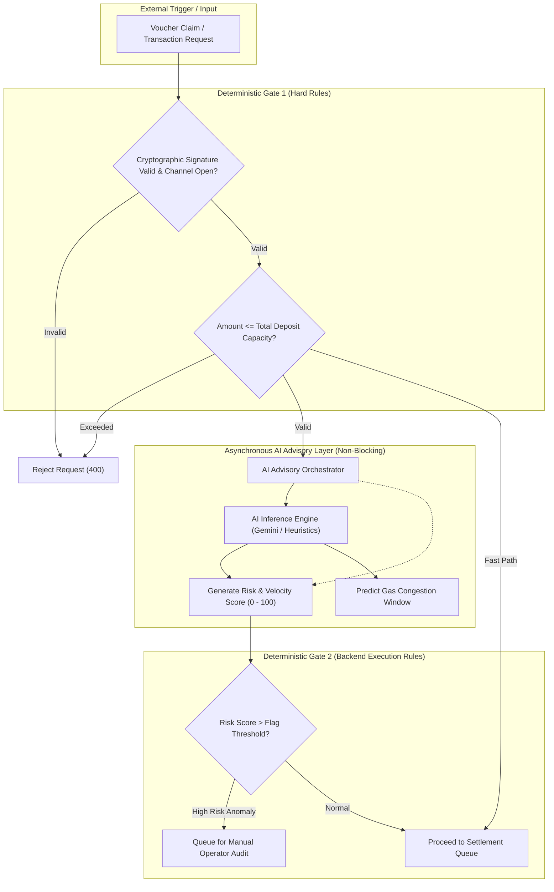

# AI Subsystem Architecture & Operational Guardrails

> **Document Version:** 1.0.0  
> **Status:** Architecture Approved  
> **Scope:** AI Role Definition, Operational Boundaries, Deterministic Guardrails, Threat Containment

---

## 1. AI System Boundary & Core Principle

> **Fundamental Invariant:**  
> The AI Subsystem operates strictly as a **non-authoritative, advisory component**.  
> An AI model (LLM or heuristic) **CANNOT**:
> - Authorize or reject a payment on its own authority.
> - Hold, sign, or access cryptographic private keys.
> - Directly alter channel balances, database ledgers, or smart contract state.
> - Bypass deterministic business rules or signature checks.

---

## 2. Permitted vs. Prohibited AI Capabilities

### 2.1 Permitted Capabilities (Advisory Only)
1. **Anomaly & Velocity Analysis:**
   - Detects abnormal micropayment bursts (e.g., 500 vouchers/sec from an unfamiliar IP/merchant pairing).
   - Generates an integer risk score `[0, 100]` with categorical tags (`normal`, `burst_anomaly`, `repetition_pattern`).
2. **Settlement Gas Optimization:**
   - Analyzes recent historical gas trends (`baseFee`, `priorityFee`) on the target EVM chain.
   - Advises the relayer worker on the optimal block window (e.g., next 10 minutes vs next 2 hours) to submit batch settlements.
3. **Conversational Billing & Merchant Insights:**
   - Translates raw hexadecimal channel/voucher ledgers into natural language merchant reports (e.g., "Top 5 API consumers this week", "Revenue breakdown by channel").

### 2.2 Strictly Prohibited AI Capabilities
- ❌ **Zero Autonomous Fund Transfer:** AI models cannot invoke `transfer`, `settleClaim`, or any smart contract write function.
- ❌ **Zero Access to Private Keys / Secrets:** Relayer private keys, user passwords, database credentials, and webhook secrets are strictly segregated and inaccessible to AI prompts or runtimes.
- ❌ **Zero Override Authority:** An AI recommendation cannot override a failed cryptographic signature check or permit an over-limit claim.

---

## 3. Data Privacy & Redaction Pipeline

Before any transaction metadata is passed to an LLM provider:
1. **Sanitization:** Strip all IP addresses, personal identifiers, and email addresses.
2. **Wallet Masking:** Truncate wallet addresses to first 6 and last 4 characters for pattern analysis (e.g., `0x1234...5678`), preventing public tracing correlation inside model context.
3. **Payload Restriction:** Only send numerical intervals, frequency metrics, and aggregate token counts.

---

## 4. Failure Modes & Resilience Architecture

| Failure Scenario | AI State | System Impact & Fallback |
| :--- | :--- | :--- |
| **API Timeout / Latency (> 3000ms)** | AI Unresponsive | **Fail Open / Static Rule Fallback:** Backend applies deterministic rate-limiting rules. Real-time vouchers proceed without latency degradation. |
| **Model Hallucination / Malformed JSON** | Invalid Output | **Schema Validation Rejection:** Response fails Zod schema validation; score defaults to neutral `50`; warning logged to monitoring. |
| **Prompt Injection Attempt via Metadata** | Malicious Input | **Strict Input Masking:** Merchant metadata strings are never passed as executable instructions; prompts use structured few-shot JSON templates with system-enforced delimiters. |
| **External AI Outage (Provider Down)** | Service Down | **Circuit Breaker:** Relayer continues using standard EIP-1559 gas calculation; platform remains 100% operational. |
