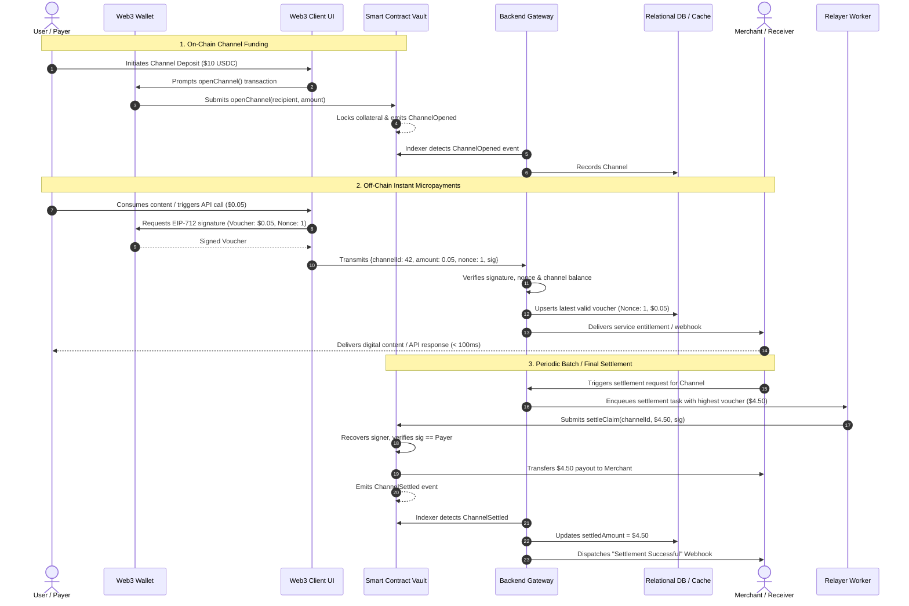

# End-to-End Transaction Flow & Data Architecture

> **Document Version:** 1.0.0  
> **Status:** Architecture Approved  
> **Scope:** Complete Micropayment Lifecycle, Sequence Diagrams, and Core Data Domains

---

## 1. End-to-End Micropayment Lifecycle

The Web3 MicroPay transaction flow is bifurcated into:
1. **On-Chain Initialization (Channel Funding)**
2. **High-Frequency Off-Chain Micropayment Exchange (Sub-100ms)**
3. **On-Chain Claim Settlement & Final Reconciliation**

---

## 2. Step-by-Step Transaction Specification

| Step | Responsible Component | Input | Processing | Output / Failure Handling | Security Requirement |
| :--- | :--- | :--- | :--- | :--- | :--- |
| **1. Channel Deposit** | User Wallet & Contract | Token amount, Recipient address, Expiry | Contract transfers ERC-20 to vault, creates channel record. | If tx reverts: funds stay with user. | User verifies contract address on Etherscan/wallet. |
| **2. Event Ingestion** | Blockchain Indexer | WebSocket log: `ChannelOpened` | Validates block confirmations, upserts channel in DB. | If RPC fails: worker reconnects with block back-fill. | Only process confirmed logs (depth >= 6). |
| **3. Voucher Generation** | Frontend Client & Wallet | Channel ID, Cumulative amount, Nonce | Formats EIP-712 payload; requests wallet signature. | If user rejects: payment aborted. | Zero private key access by web application. |
| **4. Voucher Validation** | Backend Gateway | EIP-712 payload & signature | Recovers ECDSA signer; verifies `signer == payer`; checks `amount <= deposit`. | If invalid: returns 400 Bad Signature. | Strict replay protection via `nonce` and `chainId`. |
| **5. Off-chain Ledger** | Database & Cache | Validated voucher | Atomic write to Redis/Postgres; updates counterparty balance. | If DB down: return 500; merchant halts content delivery. | Idempotency key per request. |
| **6. On-chain Settlement** | Relayer & Smart Contract | Latest cumulative voucher & signature | Invokes `settleClaim()`; contract verifies ECDSA and transfers tokens. | If out-of-gas: relayer bumps gas fee and retries. | Smart contract checks `cumulativeAmount > settledAmount`. |
| **7. Merchant Webhook** | Notification Dispatcher | Event: `payment.settled` | Sends HMAC-SHA256 signed HTTP POST to merchant endpoint. | If timeout: exponential backoff retry up to 5 attempts. | Webhook signed with shared secret to prevent spoofing. |

---

## 3. Data Domains & Storage Architecture

| Domain | Storage Engine | Sensitivity | Owner | Lifecycle & Retention | Blockchain Reference |
| :--- | :--- | :--- | :--- | :--- | :--- |
| **Users / Wallets** | PostgreSQL | Medium (Public keys, preferences) | Backend API | Permanent until deletion | Wallet addresses |
| **Channels** | PostgreSQL + Redis | High (Balance, status, expiration) | Blockchain Indexer & Vault | Created on-chain; archived 90 days after close | `channelId` (bytes32), Tx hash |
| **Micropayment Vouchers** | PostgreSQL + Redis | High (Cryptographic signatures, amounts) | Voucher Service | Active during channel lifetime; archived after settlement | `channelId`, `nonce`, signature |
| **Settlement Receipts** | PostgreSQL | High (Financial payouts, gas spent) | Relayer Service | Permanent financial ledger (7 years) | `settlementTxHash`, Block number |
| **Webhook Dispatches** | PostgreSQL | Low (Delivery logs, response codes) | Notification Engine | Retained 30 days for debugging | Linked to `settlementId` |
| **AI Advisory Logs** | PostgreSQL / Elastic | Low (Risk scores, token usage, latency) | AI Gateway | Retained 30 days for performance tuning | Anonymous channel reference |
| **Audit Trails** | PostgreSQL (Append-Only) | Critical (Administrative actions, security events) | Security Subsystem | Immutable, tamper-evident (10 years) | Operator addresses, Tx hashes |
