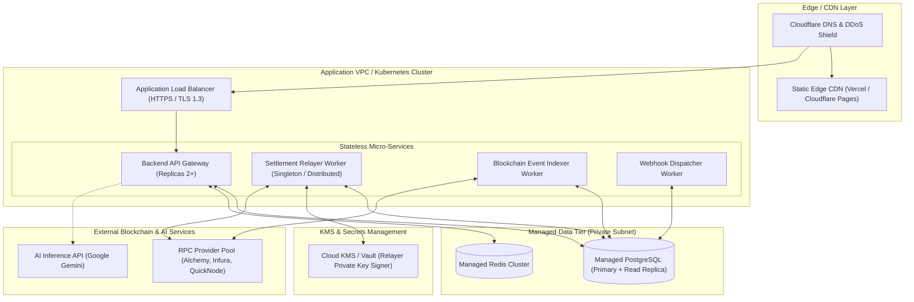

# Deployment Topology & Observability Architecture

> **Document Version:** 1.0.0  
> **Status:** Architecture Approved  
> **Scope:** Cloud Infrastructure, Network Topology, Containerization, and Observability

---

## 1. Deployment Topology Diagram



---

## 2. Infrastructure Specifications by Tier

### 2.1 Edge & Frontend Hosting
- **Target:** Vercel or Cloudflare Pages.
- **Content:** Static SPA build (`dist/`) generated by Vite.
- **CDN Caching:** Aggressive caching on static JS/CSS bundles; zero client-side private key storage.

### 2.2 Backend API & Worker Nodes
- **Target:** AWS ECS (Fargate) or Kubernetes (EKS / GKE) containerized via Docker.
- **Scaling:** Horizontal Pod Autoscaler (HPA) targeting CPU utilization < 70% and latency < 150ms.
- **Relayer Worker Isolation:** The relayer service runs in a dedicated worker pod with strict egress filtering, isolated from public internet ingress.

### 2.3 Managed Data Tier
- **Relational Database:** AWS RDS PostgreSQL (Multi-AZ in production) with SSL enforced (`sslmode=require`).
- **Cache:** Redis Cluster for fast nonce checking, rate-limiting counters, and pub/sub message dispatching.

---

## 3. Observability & Monitoring Architecture

### 3.1 Structured Logging
- **Format:** JSON formatted logs via `Pino` logger with standardized fields:
  ```json
  {
    "level": "info",
    "time": "2026-10-01T17:23:45.123Z",
    "traceId": "c4b8-4d5e-9f1a",
    "channelId": "0x789a...",
    "action": "voucher.verified",
    "amount": "50000",
    "durationMs": 14
  }
  ```
- **Redaction:** Automatic redaction filters for `password`, `privateKey`, `seedPhrase`, `authorization`, and `secret`.

### 3.2 Health Check Endpoints
- `/health/liveness`: Returns HTTP 200 if Node.js runtime is responding.
- `/health/readiness`: Returns HTTP 200 only if:
  - Database connection pool is active.
  - Redis connection is responsive.
  - RPC provider latest block is within 10 blocks of wall clock time.

### 3.3 Metrics & Alerting (Prometheus & Grafana)
- `micropay_vouchers_processed_total`: Counter by channel and status.
- `micropay_settlement_gas_cost_gwei`: Histogram tracking on-chain gas expenditure.
- `micropay_indexer_block_lag`: Gauge measuring difference between current blockchain head and indexed block. Alert fires if lag > 15 blocks.
- `micropay_webhook_failures_total`: Counter for dead-lettered webhook deliveries.
