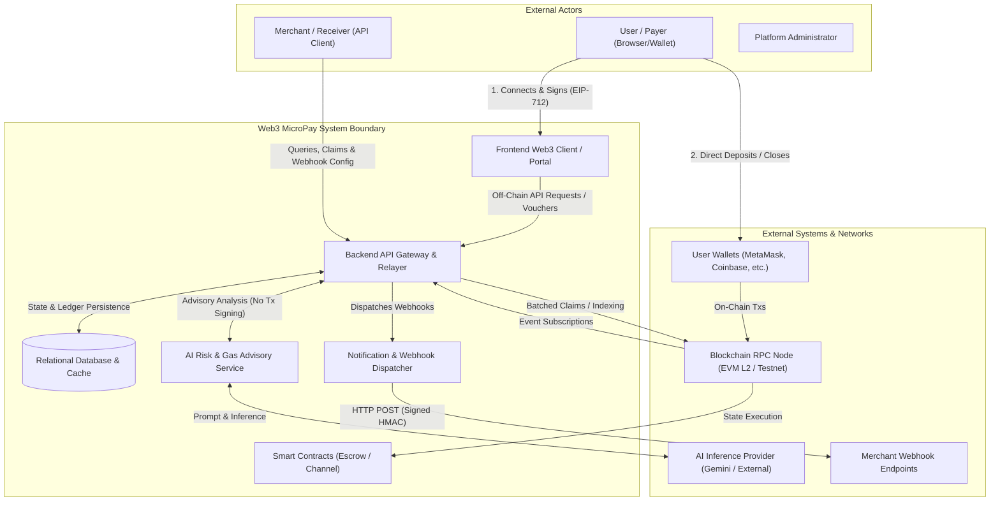

# System Context & System Boundary Definition

> **Document Version:** 1.0.0  
> **Status:** Architecture Approved  
> **Scope:** Web3 MicroPay Platform Boundaries, External Actors & Dependencies

---

## 1. Problem Statement & System Purpose

### 1.1 The Core Problem
Direct on-chain execution of micro-transactions (e.g., $0.001 - $2.00 for pay-per-article, per-minute streaming, API query metering, or content tipping) suffers from:
1. **Economic Prohibitive Cost:** A $0.05 gas fee on a $0.01 payment represents a 500% fee overhead.
2. **Latency & UX Friction:** Waiting 2 to 15 seconds for block inclusion breaks real-time content delivery or API streaming.
3. **Throughput Bottlenecks:** Public blockchains cannot support tens of thousands of continuous sub-second micropayments without network congestion.

### 1.2 The Web3 MicroPay Solution
Web3 MicroPay decouples **payment authorization** from **on-chain settlement**:
- **On-Chain:** Initial funding of a non-custodial escrow channel, periodic cumulative net claim settlement, and dispute resolution.
- **Off-Chain:** Sub-millisecond cryptographic vouchers signed via **EIP-712** by the user's wallet, validated instantly by the backend/merchant without incurring gas.
- **AI Advisory Subsystem:** Sandboxed risk assessment, fraud anomaly detection, and gas price optimization for batch settlements.

---

## 2. System Context Diagram

---

## 3. System Boundary Definition

### 3.1 Inside System Boundary (Owned & Operated)
| Subsystem | Core Responsibilities |
| :--- | :--- |
| **Frontend Web3 Client** | Wallet connection, deposit UX, local EIP-712 voucher signing, merchant dashboard, payment stream visualizer. |
| **Backend API Gateway** | Authentication (SIWE), voucher verification, nonce tracking, channel ledger management, rate limiting. |
| **Relayer & Settlement Engine** | Assembles cumulative voucher claims, schedules gas-optimized batch settlements on-chain. |
| **Blockchain Event Indexer** | Listens to smart contract events (`ChannelOpened`, `ChannelToppedUp`, `ChannelSettled`, `ChannelClosed`), syncs off-chain DB. |
| **Database & Cache** | Stores user profiles, channels, vouchers, settlement receipts, audit logs, and idempotency keys. |
| **AI Advisory Subsystem** | Heuristic & LLM-driven transaction anomaly scoring, batching timing optimization, natural language billing assistance. |
| **Notification Engine** | Dispatches real-time WebSocket events to frontend and signed HMAC webhooks to merchant endpoints. |
| **Smart Contracts** | Non-custodial vault holding deposited tokens/ETH, verifying ECDSA signatures, paying claims, resolving disputes. |

### 3.2 Outside System Boundary (External Dependencies)
| External Dependency | Purpose | Failure Mode & Resilience Strategy |
| :--- | :--- | :--- |
| **User Wallet (EIP-1193)** | User holds private keys; signs deposits & vouchers. | System never sees private keys. If wallet disconnects, session terminates cleanly. |
| **EVM Blockchain / RPC** | L2/L1 network executing smart contracts. | Redundant multi-RPC providers (Alchemy, Infura, QuickNode) with automatic fallback failover. |
| **External AI Provider** | Generates risk scores and gas timing predictions. | Non-blocking advisory role. If unreachable, backend falls back to deterministic rule engine. |
| **Merchant Webhooks** | Merchant receives payment receipts. | Exponential backoff retry queue with dead-letter queue (DLQ) after 5 failed attempts. |
