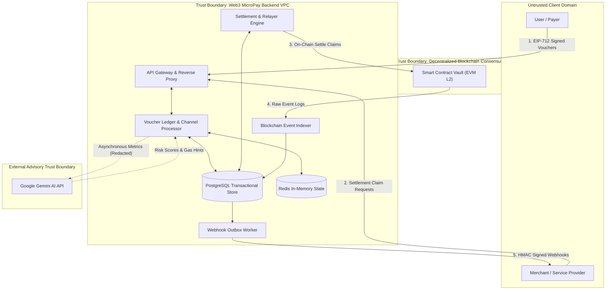
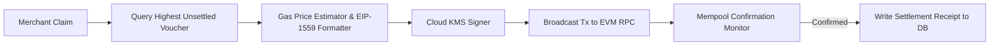
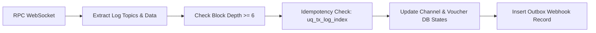
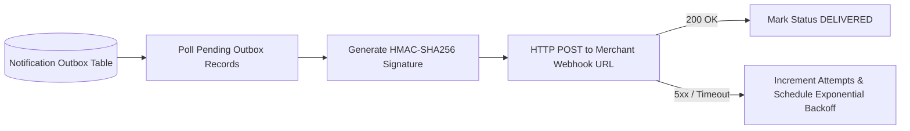

# System Data-Flow Diagrams & Trust Boundaries

> **Document Version:** 1.0.0  
> **Status:** Detailed Design Complete  
> **Notation:** Gane & Sarson / Structured Analysis with Trust Boundaries

---

## 1. Level 0 System Context Data-Flow Diagram

---

## 2. Level 1 Data-Flow Diagrams

### 2.1 Level 1 Payment & Voucher Ingestion Flow

```mermaid
flowchart LR
    P[Payer Client] -->|Voucher Payload| V1[Validate Schema & Types]
    V1 -->|Valid JSON| V2[Atomic Nonce Check - Redis]
    V2 -->|Nonce > Current| V3[ECDSA Signature Recovery]
    V3 -->|Signer == Payer| V4[Check Capacity <= Total Deposit]
    V4 -->|Within Capacity| V5[Commit Voucher to PostgreSQL]
    V5 -->|Success| RESP[Return 200 Authorized to Merchant]
```

### 2.2 Level 1 Settlement Flow

### 2.3 Level 1 Blockchain Indexing Flow

### 2.4 Level 1 Notification Flow

---

## 3. Trust Boundary Definitions
1. **Client Trust Boundary:** The user's browser and wallet are considered untrusted environments. All inputs undergo strict cryptographic recovery and validation on the backend.
2. **Backend VPC Trust Boundary:** Private subnet containing API nodes, PostgreSQL, Redis, and KMS connection agents. Access is strictly governed via IAM and TLS 1.3.
3. **External AI Trust Boundary:** Third-party cloud LLM. Read-only advisory role; receives zero PII; has zero access to private keys or database credentials.
4. **Blockchain Consensus Trust Boundary:** The EVM Layer-2 network is the ultimate arbiter of fund solvency and dispute resolution.
