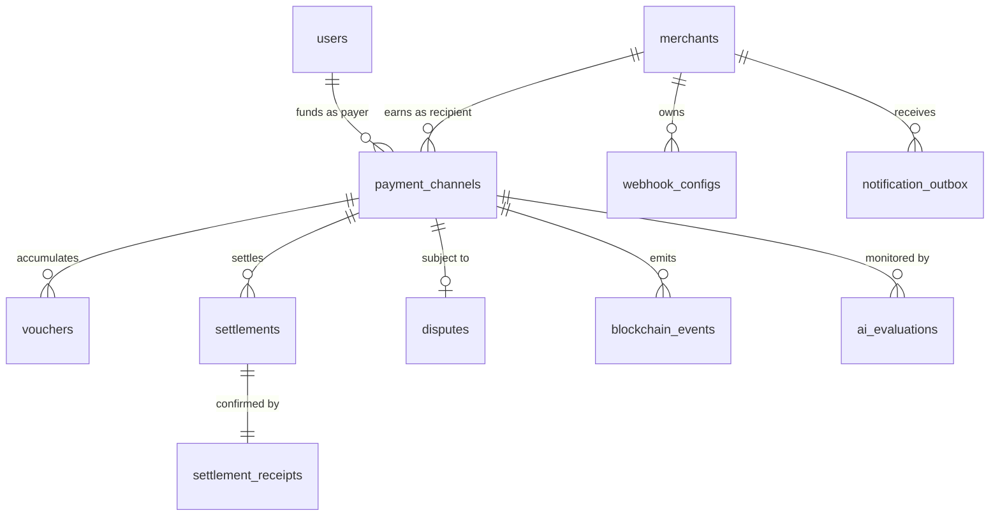

# Database Design, Relationships & Consistency Model

> **Document Version:** 1.0.0  
> **Status:** Detailed Design Complete  
> **Primary Storage:** PostgreSQL 15+ (Relational / ACID)  
> **Ephemeral Storage:** Redis 7+ (In-Memory / Nonce Cache)

---

## 1. Relational Database Schema Specifications (12 Tables)

### Table 1: `users`
- **Purpose:** Stores authenticated user identities and wallet associations.
- **Columns:**
  - `id`: UUID PRIMARY KEY DEFAULT `gen_random_uuid()`
  - `wallet_address`: VARCHAR(42) NOT NULL UNIQUE (EIP-55 checksummed)
  - `username`: VARCHAR(100) NULL
  - `email`: VARCHAR(255) NULL (AES-256 encrypted)
  - `role`: user_role_enum NOT NULL DEFAULT 'USER'
  - `created_at`: TIMESTAMPTZ NOT NULL DEFAULT NOW()
  - `updated_at`: TIMESTAMPTZ NOT NULL DEFAULT NOW()
  - `deleted_at`: TIMESTAMPTZ NULL (Soft deletion)
- **Indexes:** `idx_users_wallet` (B-tree on `wallet_address`).

### Table 2: `merchants`
- **Purpose:** Service providers accepting micropayments, managing API keys and billing profiles.
- **Columns:**
  - `id`: UUID PRIMARY KEY DEFAULT `gen_random_uuid()`
  - `wallet_address`: VARCHAR(42) NOT NULL UNIQUE
  - `business_name`: VARCHAR(100) NOT NULL
  - `api_key_hash`: VARCHAR(64) NOT NULL UNIQUE (SHA-256)
  - `is_active`: BOOLEAN NOT NULL DEFAULT TRUE
  - `created_at`: TIMESTAMPTZ NOT NULL DEFAULT NOW()
  - `updated_at`: TIMESTAMPTZ NOT NULL DEFAULT NOW()
- **Indexes:** `idx_merchants_wallet`, `idx_merchants_api_key_hash`.

### Table 3: `payment_channels`
- **Purpose:** Canonical off-chain representation of on-chain escrow payment channels.
- **Columns:**
  - `channel_id`: VARCHAR(66) PRIMARY KEY (0x + 64 hex characters)
  - `payer_address`: VARCHAR(42) NOT NULL REFERENCES users(wallet_address)
  - `recipient_address`: VARCHAR(42) NOT NULL REFERENCES merchants(wallet_address)
  - `token_address`: VARCHAR(42) NOT NULL (0x0 for native ETH)
  - `total_deposit`: NUMERIC(78, 0) NOT NULL
  - `settled_amount`: NUMERIC(78, 0) NOT NULL DEFAULT 0
  - `reserved_amount`: NUMERIC(78, 0) NOT NULL DEFAULT 0
  - `expiration_timestamp`: BIGINT NOT NULL
  - `dispute_period_seconds`: BIGINT NOT NULL DEFAULT 86400
  - `status`: channel_status_enum NOT NULL DEFAULT 'PENDING'
  - `open_tx_hash`: VARCHAR(66) NULL
  - `open_block_number`: BIGINT NULL
  - `created_at`: TIMESTAMPTZ NOT NULL DEFAULT NOW()
  - `updated_at`: TIMESTAMPTZ NOT NULL DEFAULT NOW()
- **Constraints:**
  - `chk_settled_deposit`: `settled_amount <= total_deposit`
  - `chk_reserved_deposit`: `reserved_amount <= total_deposit`
- **Indexes:** `idx_channels_payer`, `idx_channels_recipient`, `idx_channels_status`.

### Table 4: `vouchers`
- **Purpose:** Records off-chain signed cryptographic micropayment vouchers.
- **Columns:**
  - `id`: UUID PRIMARY KEY DEFAULT `gen_random_uuid()`
  - `channel_id`: VARCHAR(66) NOT NULL REFERENCES payment_channels(channel_id) ON DELETE CASCADE
  - `nonce`: BIGINT NOT NULL
  - `cumulative_amount`: NUMERIC(78, 0) NOT NULL
  - `signature`: VARCHAR(132) NOT NULL (0x + 130 hex ECDSA signature)
  - `valid_until`: BIGINT NOT NULL
  - `is_settled`: BOOLEAN NOT NULL DEFAULT FALSE
  - `created_at`: TIMESTAMPTZ NOT NULL DEFAULT NOW()
- **Unique Constraint:** `uq_channel_nonce` ON `(channel_id, nonce)`
- **Indexes:** `idx_vouchers_channel_nonce_desc` ON `(channel_id, nonce DESC)`.

### Table 5: `settlements`
- **Purpose:** Tracks on-chain claim execution requests, relayer batching, and payout status.
- **Columns:**
  - `id`: UUID PRIMARY KEY DEFAULT `gen_random_uuid()`
  - `channel_id`: VARCHAR(66) NOT NULL REFERENCES payment_channels(channel_id)
  - `voucher_id`: UUID NOT NULL REFERENCES vouchers(id)
  - `claimed_amount`: NUMERIC(78, 0) NOT NULL
  - `net_payout`: NUMERIC(78, 0) NOT NULL
  - `relayer_gas_fee`: NUMERIC(78, 0) NOT NULL DEFAULT 0
  - `protocol_fee`: NUMERIC(78, 0) NOT NULL DEFAULT 0
  - `status`: settlement_status_enum NOT NULL DEFAULT 'PENDING'
  - `retry_count`: INT NOT NULL DEFAULT 0
  - `created_at`: TIMESTAMPTZ NOT NULL DEFAULT NOW()
  - `finalized_at`: TIMESTAMPTZ NULL
- **Indexes:** `idx_settlements_channel`, `idx_settlements_status`.

### Table 6: `settlement_receipts`
- **Purpose:** Immutable on-chain receipt logs for mined settlement transactions.
- **Columns:**
  - `id`: UUID PRIMARY KEY DEFAULT `gen_random_uuid()`
  - `settlement_id`: UUID NOT NULL UNIQUE REFERENCES settlements(id)
  - `tx_hash`: VARCHAR(66) NOT NULL UNIQUE
  - `block_number`: BIGINT NOT NULL
  - `gas_used`: BIGINT NOT NULL
  - `effective_gas_price`: BIGINT NOT NULL
  - `created_at`: TIMESTAMPTZ NOT NULL DEFAULT NOW()
- **Indexes:** `idx_receipts_tx_hash`, `idx_receipts_block`.

### Table 7: `blockchain_events`
- **Purpose:** Raw log archive of indexed smart contract events for audit and replay.
- **Columns:**
  - `id`: UUID PRIMARY KEY DEFAULT `gen_random_uuid()`
  - `event_name`: VARCHAR(50) NOT NULL
  - `channel_id`: VARCHAR(66) NOT NULL
  - `tx_hash`: VARCHAR(66) NOT NULL
  - `block_number`: BIGINT NOT NULL
  - `log_index`: INT NOT NULL
  - `raw_data`: JSONB NOT NULL
  - `processed`: BOOLEAN NOT NULL DEFAULT TRUE
  - `created_at`: TIMESTAMPTZ NOT NULL DEFAULT NOW()
- **Unique Constraint:** `uq_tx_log_index` ON `(tx_hash, log_index)`.

### Table 8: `disputes`
- **Purpose:** Tracks unilateral channel closure proceedings and dispute countdowns.
- **Columns:**
  - `id`: UUID PRIMARY KEY DEFAULT `gen_random_uuid()`
  - `channel_id`: VARCHAR(66) NOT NULL UNIQUE REFERENCES payment_channels(channel_id)
  - `initiated_by`: VARCHAR(42) NOT NULL
  - `dispute_expires_at`: BIGINT NOT NULL
  - `counter_settled`: BOOLEAN NOT NULL DEFAULT FALSE
  - `created_at`: TIMESTAMPTZ NOT NULL DEFAULT NOW()
  - `resolved_at`: TIMESTAMPTZ NULL
- **Indexes:** `idx_disputes_expiry` ON `(dispute_expires_at)`.

### Table 9: `webhook_configs`
- **Purpose:** Merchant webhook configuration and HMAC signing secrets.
- **Columns:**
  - `id`: UUID PRIMARY KEY DEFAULT `gen_random_uuid()`
  - `merchant_id`: UUID NOT NULL REFERENCES merchants(id) ON DELETE CASCADE
  - `url`: VARCHAR(255) NOT NULL
  - `hmac_secret`: VARCHAR(64) NOT NULL
  - `subscribed_events`: VARCHAR(50)[] NOT NULL
  - `is_enabled`: BOOLEAN NOT NULL DEFAULT TRUE
  - `created_at`: TIMESTAMPTZ NOT NULL DEFAULT NOW()
  - `updated_at`: TIMESTAMPTZ NOT NULL DEFAULT NOW()
- **Indexes:** `idx_webhook_merchant` ON `merchant_id`.

### Table 10: `notification_outbox`
- **Purpose:** Transactional outbox ensuring at-least-once webhook delivery.
- **Columns:**
  - `id`: UUID PRIMARY KEY DEFAULT `gen_random_uuid()`
  - `merchant_id`: UUID NOT NULL REFERENCES merchants(id) ON DELETE CASCADE
  - `event_type`: VARCHAR(50) NOT NULL
  - `payload`: JSONB NOT NULL
  - `target_url`: VARCHAR(255) NOT NULL
  - `attempts`: INT NOT NULL DEFAULT 0
  - `delivery_status`: delivery_status_enum NOT NULL DEFAULT 'PENDING'
  - `last_error`: TEXT NULL
  - `next_retry_at`: TIMESTAMPTZ NOT NULL DEFAULT NOW()
  - `created_at`: TIMESTAMPTZ NOT NULL DEFAULT NOW()
- **Indexes:** `idx_outbox_queue` ON `(delivery_status, next_retry_at)`.

### Table 11: `ai_evaluations`
- **Purpose:** Stores risk scores and gas forecasting recommendations from the AI advisory service.
- **Columns:**
  - `id`: UUID PRIMARY KEY DEFAULT `gen_random_uuid()`
  - `channel_id`: VARCHAR(66) NULL REFERENCES payment_channels(channel_id) ON DELETE SET NULL
  - `evaluation_type`: VARCHAR(50) NOT NULL
  - `risk_score`: INT NOT NULL
  - `reasoning_tags`: JSONB NOT NULL
  - `raw_advisory_payload`: JSONB NOT NULL
  - `created_at`: TIMESTAMPTZ NOT NULL DEFAULT NOW()
- **Constraint:** `chk_risk_bounds`: `risk_score BETWEEN 0 AND 100`.

### Table 12: `audit_logs`
- **Purpose:** Immutable append-only record of security and administrative actions.
- **Columns:**
  - `id`: UUID PRIMARY KEY DEFAULT `gen_random_uuid()`
  - `actor_address`: VARCHAR(42) NOT NULL
  - `action`: VARCHAR(50) NOT NULL
  - `details`: JSONB NOT NULL
  - `ip_address`: VARCHAR(45) NULL
  - `created_at`: TIMESTAMPTZ NOT NULL DEFAULT NOW()
- **Indexes:** `idx_audit_actor`, `idx_audit_action`.

---

## 2. Entity-Relationship (ER) Model

### Relationship Breakdown
- **User to Payment Channel (1-to-Many):** A single user wallet can fund multiple direct channels with different merchants.
- **Merchant to Payment Channel (1-to-Many):** A merchant receives payments across thousands of channels opened by independent payers.
- **Payment Channel to Voucher (1-to-Many):** A channel holds a sequence of vouchers with strictly increasing nonces (`1, 2, ... N`).
- **Payment Channel to Settlement (1-to-Many):** A channel can be settled periodically throughout its lifetime as claims are redeemed.
- **Settlement to Settlement Receipt (1-to-1):** Every mined settlement produces exactly one immutable blockchain receipt record.
- **Payment Channel to Dispute (1-to-0..1):** A channel enters dispute state at most once during an uncooperative exit.

---

## 3. Data Consistency Model & Authoritativeness Matrix

| Data Domain | Authoritative Source of Truth | Secondary / Operational Store | Cache / Ephemeral Layer | Consistency Guarantee |
| :--- | :---: | :---: | :---: | :--- |
| **Escrow Collateral & Channel Status** | **Blockchain (`MicroPayVault.sol`)** | PostgreSQL (`payment_channels`) | Redis (`channel:nonce`) | **Eventual Consistency** (Synced within 6 confirmations; reconciled every 10 min). |
| **Signed Micro-Vouchers** | **PostgreSQL (`vouchers`)** | Merchant Client Local Storage | Redis (`channel:reserved`) | **Strong Consistency** within backend database cluster. |
| **Nonce & Replay State** | **Redis (`channel:nonce`)** | PostgreSQL (`vouchers.nonce`) | Smart Contract (`channelNonces`) | **Strong Sequential Consistency** enforced by atomic Redis Lua scripts. |
| **Webhook Delivery State** | **PostgreSQL (`notification_outbox`)** | None | Redis Task Queue | **At-Least-Once Delivery** guaranteed via Transactional Outbox pattern. |
| **AI Risk Evaluations** | **PostgreSQL (`ai_evaluations`)** | None | None | **Best-Effort Asynchronous** advisory persistence. |

### Reconciliation & Dispute Recovery
Every 10 minutes, the background **Reconciliation Cron** queries on-chain channel states via `getChannel(channelId)`:
- If `contract.settledAmount != db.settled_amount`, the database is updated to match on-chain reality.
- If a channel is `DISPUTED` on-chain but marked `OPEN` in DB, the status is immediately updated and an emergency alert is triggered.
