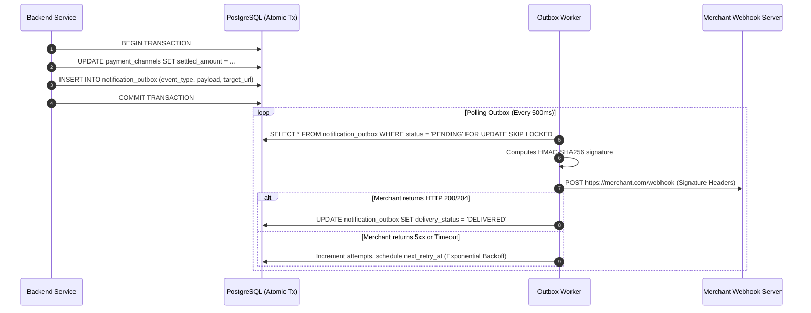

# Notification & Webhook Dispatcher Specification

> **Document Version:** 1.0.0  
> **Status:** Detailed Design Complete  
> **Architecture Pattern:** Transactional Outbox & Signed HMAC-SHA256 Webhooks

---

## 1. Webhook Architecture & Transactional Outbox

To guarantee that merchant notifications are never lost if the server restarts:
1. When a payment is authorized or a settlement is confirmed, the state change and an unread record in `notification_outbox` are committed in the **same atomic database transaction**.
2. A background worker polls the outbox, signs the payload, and dispatches the HTTP request.

---

## 2. Webhook Security & Signature Protocol

### Headers Sent with Every Webhook
- `Content-Type: application/json`
- `X-MicroPay-Event: payment.authorized | settlement.confirmed | channel.disputed`
- `X-MicroPay-Timestamp: 1790877600` (Unix timestamp in seconds)
- `X-MicroPay-Signature: t=1790877600,v1=5d41402abc4b2a76b9719d911017c592...`

### Signature Verification Algorithm
$$\text{signedPayload} = \text{timestamp} + "." + \text{rawBody}$$
$$\text{v1} = \text{HMAC-SHA256}(\text{signedPayload}, \text{merchantSecret})$$

Merchants reject any webhook where `abs(now - timestamp) > 300 seconds` to eliminate replay attacks.

---

## 3. Exponential Backoff & Dead-Letter Policy
- **Attempt 1:** Immediate.
- **Attempt 2:** +5 seconds.
- **Attempt 3:** +30 seconds.
- **Attempt 4:** +5 minutes.
- **Attempt 5:** +1 hour.
- **After 5 Failures:** Status updated to `DEAD_LETTER`.
- **Manual Replay:** Merchant can trigger `POST /v1/webhooks/replay` from the dashboard to re-enqueue failed deliveries.
