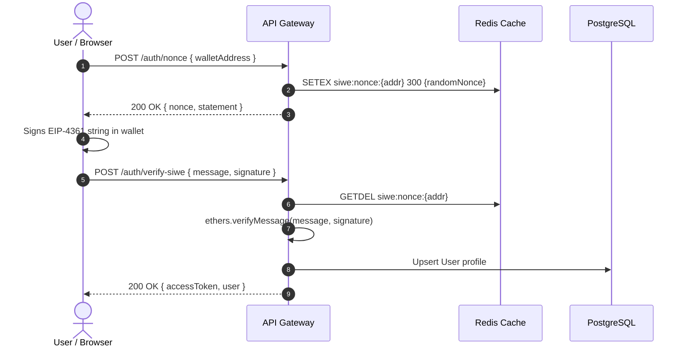
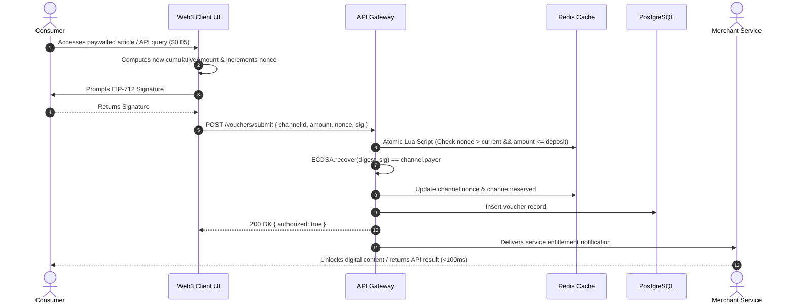
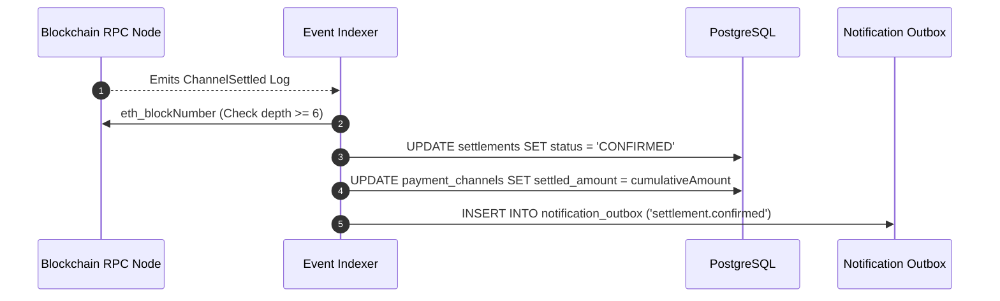
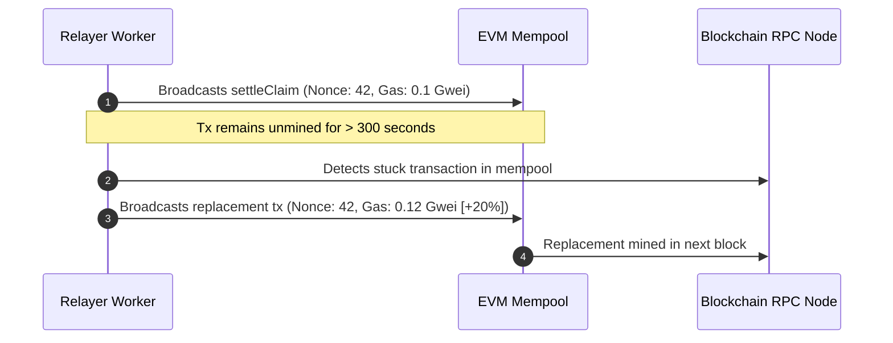

# Complete Sequence Diagrams (12 Core System Flows)

> **Document Version:** 1.0.0  
> **Status:** Detailed Design Complete  
> **Scope:** End-to-End Sequence Workflows across all 12 operational paths

---

## Flow 1: User Authentication (SIWE)


---

## Flow 2: Channel Creation
```mermaid
sequenceDiagram
    autonumber
    actor User as User / Payer
    participant Wallet as Web3 Wallet
    participant Vault as MicroPayVault.sol
    participant RPC as Blockchain RPC Node
    participant Indexer as Event Indexer
    participant DB as PostgreSQL

    User->>Wallet: Confirms openChannel(recipient, token, amount, expiry, disputePeriod)
    Wallet->>RPC: eth_sendRawTransaction
    RPC->>Vault: Executes openChannel()
    Vault-->>Vault: Locks collateral tokens; emits ChannelOpened
    RPC-->>Indexer: WebSocket Log: ChannelOpened
    Indexer->>Indexer: Verifies block confirmation depth >= 6
    Indexer->>DB: INSERT INTO payment_channels (status: 'OPEN')
```

---

## Flow 3: Channel Funding (Top-Up)
```mermaid
sequenceDiagram
    autonumber
    actor User as User / Payer
    participant Wallet as Web3 Wallet
    participant Vault as MicroPayVault.sol
    participant Indexer as Event Indexer
    participant DB as PostgreSQL

    User->>Wallet: Confirms topUpChannel(channelId, additionalAmount)
    Wallet->>Vault: Executes topUpChannel()
    Vault-->>Vault: totalDeposit += additionalAmount; emits ChannelToppedUp
    Indexer-->>Vault: Catches ChannelToppedUp event
    Indexer->>DB: UPDATE payment_channels SET total_deposit = newTotal
```

---

## Flow 4 & Flow 5 & Flow 6: Voucher Creation, Verification & Service Delivery


---

## Flow 7: Relayer Batch Claim Settlement
```mermaid
sequenceDiagram
    autonumber
    actor Merchant as Merchant
    participant API as API Gateway
    participant Relayer as Relayer Worker
    participant KMS as Cloud KMS
    participant Vault as MicroPayVault.sol

    Merchant->>API: POST /settlements/claim { channelId }
    API->>Relayer: Enqueues settlement task with highest voucher
    Relayer->>KMS: Signs settleClaim(channelId, cumulativeAmount, sig)
    Relayer->>Vault: Submits transaction to blockchain
    Vault->>Vault: Verifies ECDSA; transfers net tokens to Merchant
    Vault-->>Vault: Emits ChannelSettled(channelId, cumulativeAmount)
```

---

## Flow 8: Blockchain Event Indexing


---

## Flow 9: Dispute (Unilateral Close & Contest)
```mermaid
sequenceDiagram
    autonumber
    actor Payer as Payer
    participant Vault as MicroPayVault.sol
    participant Indexer as Event Indexer
    actor Merchant as Merchant / Relayer

    Payer->>Vault: initiateChannelClose(channelId)
    Vault->>Vault: status = DISPUTED; disputeExpiresAt = now + 24h
    Vault-->>Indexer: Emits ChannelDisputeInitiated
    Indexer->>Merchant: Alerts of dispute initiation
    Merchant->>Vault: settleClaim(channelId, latestCumulativeVoucher, sig)
    Vault->>Vault: Verifies voucher; pays earned funds before expiry
```

---

## Flow 10: Webhook Notification (Transactional Outbox)
```mermaid
sequenceDiagram
    autonumber
    participant Outbox as Outbox Worker
    participant DB as PostgreSQL
    actor Merchant as Merchant Endpoint

    loop Poll every 500ms
        Outbox->>DB: SELECT * FROM notification_outbox WHERE status = 'PENDING'
        Outbox->>Outbox: Computes HMAC-SHA256 signature
        Outbox->>Merchant: POST target_url with X-MicroPay-Signature
        alt HTTP 200/204
            Outbox->>DB: UPDATE notification_outbox SET status = 'DELIVERED'
        else HTTP 5xx / Timeout
            Outbox->>DB: Increment attempt; schedule exponential backoff
        end
    end
```

---

## Flow 11: Failure & Recovery (Gas Bumping Replacement)


---

## Flow 12: AI Advisory Analysis (Asynchronous Anomaly Scoring)
```mermaid
sequenceDiagram
    autonumber
    participant VoucherSrv as Voucher Service
    participant AIWorker as AI Worker Queue
    participant Gemini as Google Gemini API
    participant DB as PostgreSQL

    VoucherSrv->>AIWorker: Enqueues anonymized velocity metrics (Non-blocking)
    AIWorker->>AIWorker: Strips PII; masks wallet address
    AIWorker->>Gemini: POST /v1beta/models/gemini-1.5-flash:generateContent
    alt Gemini returns valid JSON within 3000ms
        AIWorker->>AIWorker: Zod schema validation
        AIWorker->>DB: INSERT INTO ai_evaluations (risk_score, reasoning_tags)
    else Timeout > 3000ms
        AIWorker->>AIWorker: Trips circuit breaker; applies static heuristic
        AIWorker->>DB: INSERT INTO ai_evaluations (risk_score: 0, tag: 'fallback')
    end
```
