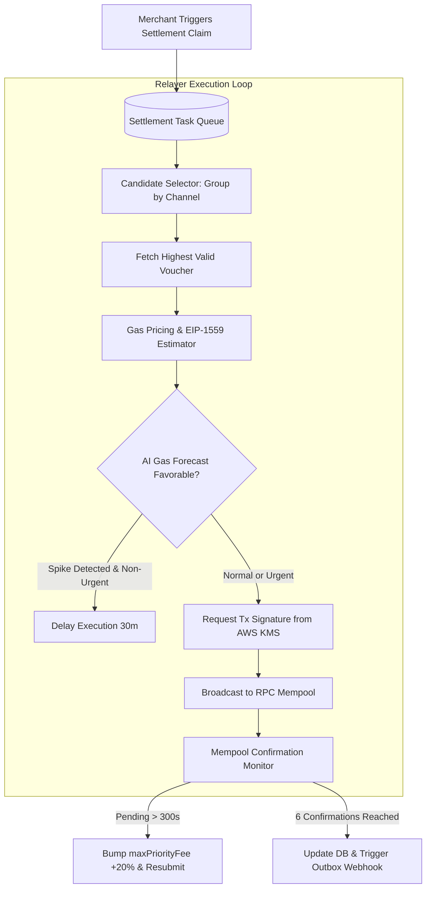

# Relayer Architecture & Settlement Engine Specification

> **Document Version:** 1.0.0  
> **Status:** Detailed Design Complete  
> **Scope:** Batch Settlement Queue, Gas Bumping, Nonce Management, and KMS Key Isolation

---

## 1. Settlement Lifecycle & Relayer Pipeline

---

## 2. Ingestion & Candidate Selection Strategy
1. **Trigger Points:**
   - **On-Demand:** Merchant requests payout via API `POST /settlements/claim`.
   - **Threshold Auto-Sweep:** Automated cron triggers settlement when channel uncollected balance exceeds $100.00.
   - **Expiration Proximity:** Channel expiration timestamp is within 48 hours.
2. **O(1) Cumulative Efficiency:**
   - Because vouchers are cumulative, the relayer submits **ONLY the voucher with the highest nonce**. Thousands of intermediary vouchers are settled simultaneously with zero incremental gas.

---

## 3. EIP-1559 Gas Pricing & Replacement Policy
- **Base Fee:** Retrieved via `eth_getBlockByNumber("latest")`.
- **Max Priority Fee:** Set to dynamic 75th percentile of recent blocks (minimum 0.05 Gwei on Arbitrum/Base).
- **Stuck Transaction Detection:** If a broadcasted transaction remains pending without block inclusion for > 5 minutes:
  1. The relayer constructs a replacement transaction with the **identical operator nonce**.
  2. Bumps `maxPriorityFeePerGas` and `maxFeePerGas` by exactly **+20%**.
  3. Broadcasts the replacement transaction, successfully replacing the stalled transaction in the EVM mempool.

---

## 4. Operator Nonce Management & Concurrency
- **Single-Threaded Nonce Worker:** To prevent transaction collisions, an in-memory Redis mutex (`relayer:nonce:lock`) serializes transaction dispatch.
- **Local Nonce Cache:** The relayer tracks `currentOperatorNonce` and only queries `eth_getTransactionCount` on service restart or when resynchronizing after a revert.

---

## 5. Key Management & Hardware Security (HSM / KMS)
- **Zero Plaintext Keys:** The relayer never holds raw ECDSA private keys in container RAM, disk, or `.env` files.
- **Signing Mechanism:** Uses AWS CloudHSM or Google Cloud KMS (secp256k1 curve) via REST API `kms.sign()`.
- **Fund Isolation:** The relayer wallet holds only minimal native gas tokens (e.g., 0.1 ETH). An automated alert fires if the relayer balance falls below 0.02 ETH.
