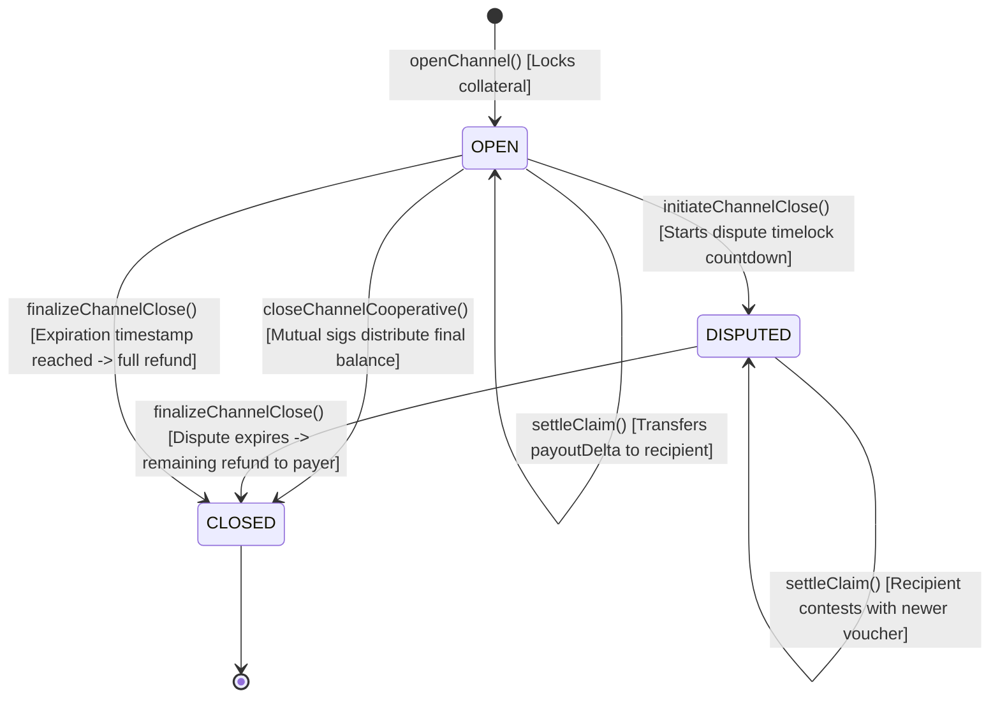

# Smart Contract Technical Specification & Upgrade Governance

> **Document Version:** 1.0.0  
> **Status:** Detailed Design Complete  
> **Contract:** `MicroPayVault.sol`  
> **Target Compiler:** Solidity `^0.8.24` | EVM Layer-2 (Arbitrum / Base / Polygon)

---

## 1. Full Solidity Interface (`IMicroPayVault.sol`)

```solidity
// SPDX-License-Identifier: MIT
pragma solidity ^0.8.24;

interface IMicroPayVault {
    enum ChannelStatus {
        NONE,
        OPEN,
        DISPUTED,
        CLOSED
    }

    struct Channel {
        address payer;
        address recipient;
        address token;              // address(0) for native ETH
        uint256 totalDeposit;
        uint256 settledAmount;
        uint48 expiration;
        uint48 disputePeriod;       // Minimum 86400 (24h)
        uint48 disputeExpiresAt;
        ChannelStatus status;
    }

    // Events
    event ChannelOpened(
        bytes32 indexed channelId,
        address indexed payer,
        address indexed recipient,
        address token,
        uint256 totalDeposit,
        uint48 expiration,
        uint48 disputePeriod
    );

    event ChannelToppedUp(bytes32 indexed channelId, uint256 addedAmount, uint256 newTotalDeposit);
    event ChannelSettled(bytes32 indexed channelId, uint256 cumulativeAmount, uint256 payoutDelta);
    event ChannelDisputeInitiated(bytes32 indexed channelId, uint48 disputeExpiresAt);
    event ChannelClosed(bytes32 indexed channelId, uint256 refundedToPayer, uint256 paidToRecipient);

    // Custom Errors
    error ChannelAlreadyExists(bytes32 channelId);
    error ChannelNotFound(bytes32 channelId);
    error ChannelNotActive(bytes32 channelId, ChannelStatus status);
    error ChannelExpired(bytes32 channelId, uint48 expiration);
    error InvalidDisputePeriod(uint48 provided, uint48 minimumRequired);
    error InvalidZeroAddress();
    error InsufficientDeposit(uint256 requested, uint256 available);
    error CumulativeAmountTooLow(uint256 provided, uint256 currentSettled);
    error InvalidSignature(address recoveredSigner, address expectedPayer);
    error VoucherExpired(uint48 validUntil, uint256 blockTimestamp);
    error DisputeWindowActive(uint48 disputeExpiresAt, uint256 blockTimestamp);
    error DisputeWindowNotElapsed(uint48 disputeExpiresAt, uint256 blockTimestamp);
    error NativeTransferFailed(address recipient, uint256 amount);
    error TokenTransferFailed(address token, address to, uint256 amount);

    // State Mutating Functions
    function openChannel(
        address recipient,
        address token,
        uint256 amount,
        uint48 expiration,
        uint48 disputePeriod
    ) external payable returns (bytes32 channelId);

    function topUpChannel(bytes32 channelId, uint256 additionalAmount) external payable;

    function settleClaim(
        bytes32 channelId,
        uint256 cumulativeAmount,
        uint256 nonce,
        uint48 validUntil,
        bytes calldata signature
    ) external;

    function closeChannelCooperative(
        bytes32 channelId,
        uint256 finalAmount,
        bytes calldata payerSignature,
        bytes calldata recipientSignature
    ) external;

    function initiateChannelClose(bytes32 channelId) external;

    function finalizeChannelClose(bytes32 channelId) external;

    // View Functions
    function getChannel(bytes32 channelId) external view returns (Channel memory);
    function DOMAIN_SEPARATOR() external view returns (bytes32);
}
```

---

## 2. Formal Smart Contract State Machine



### Transition Verification Matrix
| Transition | Caller | State Change | Invariant Enforced |
| :--- | :--- | :--- | :--- |
| `openChannel` | Payer | Creates `Channel`, `status = OPEN` | `disputePeriod >= 86400`, `totalDeposit > 0` |
| `settleClaim` | Anyone | `settledAmount = cumulativeAmount` | `recoveredSigner == payer`, `cumulativeAmount > settledAmount` |
| `initiateClose`| Payer/Recipient | `status = DISPUTED` | `disputeExpiresAt = block.timestamp + disputePeriod` |
| `finalizeClose`| Anyone | `status = CLOSED`, balance refunded | `block.timestamp >= disputeExpiresAt || block.timestamp >= expiration` |

---

## 3. Proxy & Upgrade Architecture Strategy

### 3.1 Decision: Immutable Core Escrow Vault
The primary escrow vault `MicroPayVault.sol` is deliberately designed as an **IMMUTABLE SMART CONTRACT** (No UUPS or Transparent Proxy).

### 3.2 Architectural Rationale
1. **Non-Custodial Trust:** Users deposit real funds into the vault. Upgradeable proxies introduce an existential trust compromise: an administrator or compromised multi-sig key could swap the implementation pointer to a malicious contract and drain all collateral.
2. **Zero Storage Collision Hazards:** Eliminates complex storage layout gaps, uninitialized proxies, and compiler upgrade compatibility issues.
3. **Audit Confidence:** An immutable contract with zero upgrade pointers provides 100% mathematical certainty of its execution logic for life.

### 3.3 Protocol Evolution Path
If future fee splits or cross-channel routing features are introduced, they will be deployed as an external **Router / Relayer Contract** interacting with the immutable vault via standard public interface calls.
