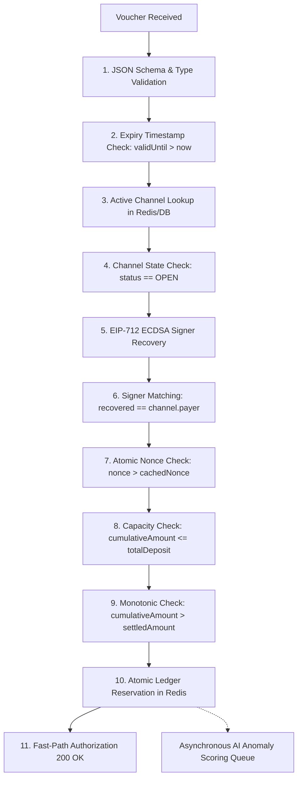

# Micropayment Voucher Protocol & Verification Engine

> **Document Version:** 1.0.0  
> **Status:** Detailed Design Complete  
> **Standard:** EIP-712 Typed Structured Data & ECDSA Cryptography

---

## 1. Cryptographic Voucher Specification

### 1.1 EIP-712 Typed Data Structure
```typescript
export const EIP712_DOMAIN = {
  name: "Web3MicroPayVault",
  version: "1",
  chainId: 42161, // e.g. Arbitrum One
  verifyingContract: "0x1234567890123456789012345678901234567890" as `0x${string}`,
} as const;

export const MICRO_VOUCHER_TYPES = {
  MicroVoucher: [
    { name: "channelId", type: "bytes32" },
    { name: "payer", type: "address" },
    { name: "recipient", type: "address" },
    { name: "cumulativeAmount", type: "uint256" },
    { name: "nonce", type: "uint256" },
    { name: "validUntil", type: "uint48" },
  ],
} as const;
```

### 1.2 Voucher JSON Wire Payload
```json
{
  "channelId": "0x98f7e6d5c4b3a21098f7e6d5c4b3a21098f7e6d5c4b3a21098f7e6d5c4b3a210",
  "payer": "0x71C633974D0e1eb5675bCE0BF9123456789013a9",
  "recipient": "0x82D4b012345678901234567890123456789014b0",
  "cumulativeAmount": "3050000000000000000",
  "nonce": 15,
  "validUntil": 1893456000,
  "signature": "0x5f6e...1a2b"
}
```

---

## 2. Step-by-Step Verification Pipeline

Every incoming voucher undergoes an 11-step verification pipeline in sub-50 milliseconds:



### Categorization of Verification Checks
| Step | Check Description | Authority Type | Impact of Failure |
| :---: | :--- | :---: | :--- |
| **1–2** | JSON structure, valid hex, expiry timestamp | **Deterministic (Static)** | 400 Bad Request |
| **3–4** | Channel exists in DB and is marked `OPEN` | **Deterministic (Operational DB)** | 404 Channel Not Found / 400 Not Active |
| **5–6** | EIP-712 `ECDSA.recover(digest, sig) == payer` | **Deterministic (Cryptographic)** | 401 Invalid Signature |
| **7** | `nonce > lastValidatedNonce` | **Deterministic (Atomic Redis)** | 400 Out of Order Nonce |
| **8–9** | Amount within deposit bounds & monotonic | **Deterministic (Cryptographic / Math)**| 400 Capacity Exceeded |
| **10** | Deduct available off-chain capacity | **Deterministic (Redis Lua Script)**| 500 Lock Contention |
| **11** | Transaction burst velocity analysis | **AI-Assisted (Asynchronous Advisory)**| Post-authorization anomaly flag |

*Invariant:* An AI model **NEVER** participates in the blocking critical path (Steps 1–10). Cryptographic and mathematical rules maintain total supremacy.
